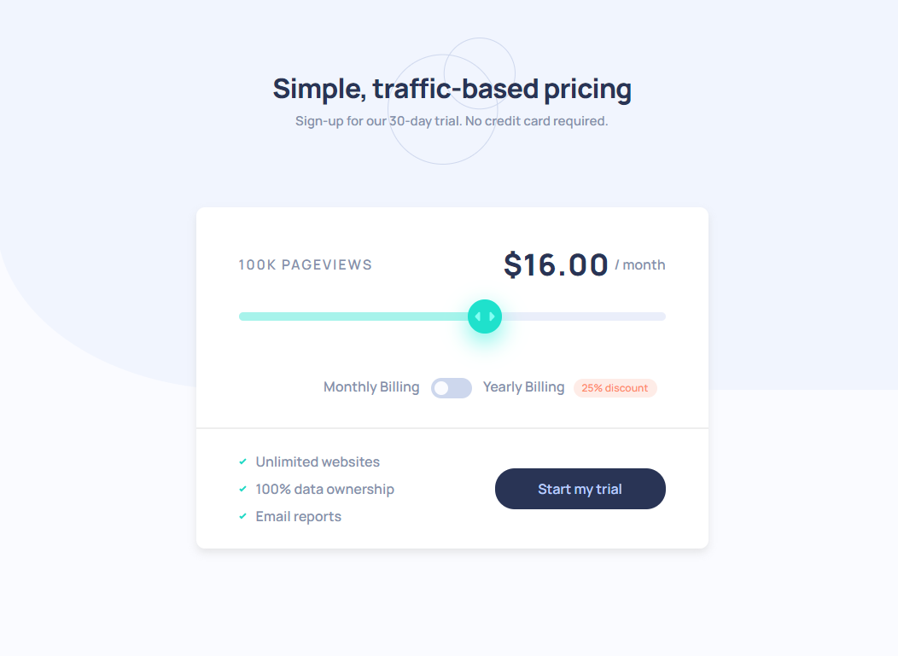

# Frontend Mentor - Interactive pricing component solution

This is a solution to the [Interactive pricing component challenge on Frontend Mentor](https://www.frontendmentor.io/challenges/interactive-pricing-component-t0m8PIyY8).

## Table of contents

- [Overview](#overview)
    - [The challenge](#the-challenge)
    - [Screenshot](#screenshot)
    - [Links](#links)
- [My process](#my-process)
    - [Built with](#built-with)
    - [What I learned](#what-i-learned)
- [Author](#author)

## Overview

### The challenge

Users should be able to:

- View the optimal layout for the app depending on their device's screen size
- See hover states for all interactive elements on the page
- Use the slider and toggle to see prices for different page view numbers

### Screenshot

### Links

- [Live Site](https://vigorous-aryabhata-44163d.netlify.app/)

## My process

### Built with

- Semantic HTML5 markup.
- CSS custom properties, flexbox, grid.
- Desktop-first workflow.
- Sass preprocessor and BEM methodology.
- Webpack bundle and PostCSS plugins.
- Vanilla JavaScript.

### What I learned

1. How to style `input[type="range"]` and `input[type="checkbox"]` tags.
2. The stacking context.
3. How to change text depending on range's value.
4. How to prevent sticky hover state on mobile devices.

## Author

- Frontend Mentor - [@bernizhel](https://www.frontendmentor.io/profile/bernizhel)
